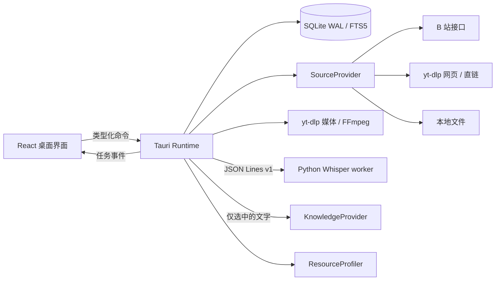

# 实现架构

## 模块边界

`crates/core` 不依赖 Tauri。负责不可变文字版本、事务和 FTS 索引、字幕解析/导出、资源候选策略、引用校验。桌面端 `service.rs` 组合 `SourceProvider`、`AsrEngine`、`KnowledgeProvider` 和 `ResourceProfiler`；替换引擎无需改变阅读界面。

桌面命令在阻塞线程池中工作；事件只是刷新提示，数据库是最终状态依据。React 不执行 shell、不直接写数据库，子进程通过参数数组启动。Windows JobObject 管理进程树，主进程退出后其子进程也终止。

`source.rs` 负责 B 站接口、本地文件与来源分流；`web_source.rs` 通过 yt-dlp 的单视频 JSON 构建 `webMedia` 预览，独立获取指定语言 SRT/VTT。元数据与字幕请求均使用 `--skip-download`；媒体路径独立调用 `bestaudio/best`，需要混合媒体时预览先提示。通用预览和字幕进程限时 120 秒并登记退出控制。前端通过 Tauri 文件对话框与 webview 拖入事件获取路径，同一时刻仅接受一个文件，并忽略已失效的预览响应。

## 存储与一致性

- `assets` 是课程/分 P；`transcripts`、`segments` 保存各版文字。校对保留片段 ID，新增版本，绝不改写旧版。
- `notes` 绑定 transcript ID，引用时间和文字必须与该版片段匹配。`stale` 由当前活动版本计算。
- `segment_fts` 使用 jieba 分词建立中文 FTS5 索引；只索引各资料的当前文字版本。
- `jobs` 记录状态/进度，配置快照保存在 `jobs/<id>.json`。批量入队通过一个事务提交，后项冲突不会留下部分可运行任务。
- `job_transcripts` 将任务 ID 绑定一次完成结果；文字、活动版本、索引与完成状态共同提交。相同任务再次提交返回原结果，不重复建立版本。
- SQLite schema v2 兼容初始化版本 v1 的升级；拒绝用旧应用打开更新的 schema。
- 取消、终态提交、校对和激活版本共用 mutation gate。设置变更有代数，耗时探测后若设置已变，拒绝将旧配置写入新库。
- 打开或切换资料库时把遗留 `running/queued` 恢复为 `paused`，由使用者选择重试。
- 每个资料库持有独占 OS 文件锁；桌面应用和诊断进程不能同时恢复同一资料库，异常退出后 OS 自动释放锁。

## 识别协议与恢复

标准输出仅含 JSONL v1；日志走 stderr。输入是 FFmpeg 生成的单声道 16 kHz PCM16 WAV。默认每块 300 秒，块边界使用全局毫秒时间戳。检查点身份包含音频 SHA256、模型、设备、语言、提示词、线程、分块尺寸、引擎版本和模型 SHA256。

每块先原子写检查点，再发进度；未完成块重新处理，已完成块直接读取。换模型或配置产生新检查点空间。完成的任务结果进入 SQLite，而中间片段仍在检查点中。性能记录写入失败不会把已提交的文字任务标为失败。

## API 与文件边界

接口默认不配置模型。云端必须 HTTPS；明确的回环本机服务可 HTTP。密钥只存 Windows 凭据存储。网站 Cookie 使用 Netscape 格式：yt-dlp 按域处理，B 站 API 只接收适用于 `api.bilibili.com` 的未过期 Cookie；只有其他网站 Cookie 时 B 站仍可匿名访问。字幕 CDN 与 AI 请求均不携带 B 站 Cookie。AI 请求明确携带所查看的 transcript ID 和选中片段；不会默默扩大或截断范围。

拒绝未知/未声明的引用；输出 Markdown 不渲染原始 HTML 和远程图片。响应读取实际限制 8 MiB，包括 chunked 响应。HTTP 超时、限流、认证失败都返回操作级错误，不改写原文。

缓存清理只接受类别，检查类别根及子目录的 junction/reparse，保护数据库、原始文件和共享模型。发布包从安装目录解析 worker，调试版从源码目录解析。
